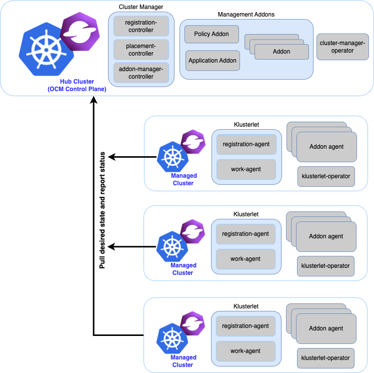

Welcome! The open-cluster-management.io project is focused on enabling end-to-end visibility and control across your Kubernetes clusters.

Please read the [MISSION.md](MISSION.md) statement for more information.

The open-cluster-management architecture uses a hub - agent model. The hub centralizes control of all the managed clusters. An agent, which we call the klusterlet, resides on each managed cluster to manage registration to the hub and run instructions from the hub.

There are a number of key use cases that are enabled by this project, and are categorized to 3 sub projects.

### Cluster Lifecycle: Cluster registration and management

The API and controllers provide the function for cluster registration, manifests delivery, cluster scheduling and addon management. Simple core functions connect clusters, such as the klusterlet, to the hub. Other components run on this base. The following repositories describe the API and controllers:

* https://github.com/open-cluster-management-io/api
* https://github.com/open-cluster-management-io/registration
* https://github.com/open-cluster-management-io/work
* https://github.com/open-cluster-management-io/placement
* https://github.com/open-cluster-management-io/registration-operator
* https://github.com/open-cluster-management-io/addon-framework

### Application Lifecycle: Delivery, upgrade, and configuration of applications on Kubernetes clusters

* Centrally create, update, and delete Kubernetes clusters across multiple private and public clouds.
* Automatically deploy applications to specific clusters by subscribing to different workload (resource) channels, such as GitHub, Helm repository, ObjectStore, and resource templates.

The application model defines a Kubernetes-first way of describing the application. Your existing Kubernetes apps or `kustomized` apps can be adapted with the addition of a few new objects: `Channel`, and `Subscription`. Changes made to the app are then easily delivered to managed clusters based on the dynamic placement engine.

The following repositories describe the underlying API and controllers for the app model:

* https://github.com/open-cluster-management-io/multicloud-operators-subscription
* https://github.com/open-cluster-management-io/multicloud-operators-channel

### GRC: Governance, Risk and Compliance across Kubernetes clusters

* Use prebuilt security and configuration controllers toto enforce policies on Kubernetes configuration across your clusters.

Policy controllers allow the declarative expression of a desired condition that can be audited or enforced against a set of managed clusters. _Policies_ allow you to drive cross-cluster configuration or validate that a certain configuration explicitly does not exist.

The following repositories describe the underlying API and controllers for the GRC model:

* https://github.com/open-cluster-management-io/config-policy-controller
* https://github.com/open-cluster-management-io/governance-policy-status-sync
* https://github.com/open-cluster-management-io/governance-policy-spec-sync
* https://github.com/open-cluster-management-io/governance-policy-template-sync
* https://github.com/open-cluster-management-io/governance-policy-propagator

### Get connected

See the following options to connect with the community:

 - [Website](https://open-cluster-management.io)
 - [Slack](https://kubernetes.slack.com/archives/C01GE7YSUUF)
 - [Mailing group](https://groups.google.com/g/open-cluster-management)
 - [Community meetings](https://github.com/open-cluster-management-io/community/projects/1)
 - [YouTube channel](https://www.youtube.com/channel/UC7xxOh2jBM5Jfwt3fsBzOZw)
