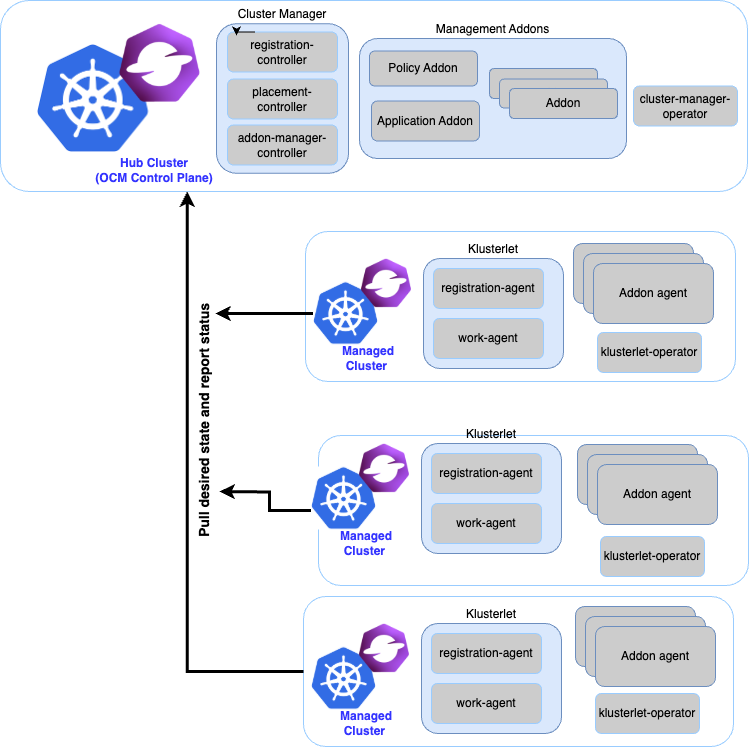

# Open Cluster Management Self-Assessment

This document evaluates the security posture of the Open Cluster Management (OCM) project, identifying current practices and areas for improvement to ensure robust security measures.

## Table of Contents

- [Open Cluster Management Self-Assessment](#open-cluster-management-self-assessment)
  - [Table of Contents](#table-of-contents)
  - [Metadata](#metadata)
  - [Overview](#overview)
    - [Background](#background)
    - [Actors](#actors)
    - [Actions](#actions)
      - [Register a managed cluster](#register-a-managed-cluster)
      - [Detach a managed cluster](#detach-a-managed-cluster)
      - [Workload distribution](#workload-distribution)
    - [Goals](#goals)
    - [Non-Goals](#non-goals)
  - [Self-assessment Use](#self-assessment-use)
  - [Security functions and features](#security-functions-and-features)
  - [Project Compliance](#project-compliance)
  - [Secure Development Practices](#secure-development-practices)
    - [Deployment Pipeline](#deployment-pipeline)
    - [Communication Channels](#communication-channels)
  - [Security Issue Resolution](#security-issue-resolution)
    - [Responsible Disclosure Practice](#responsible-disclosure-practice)
    - [Incident Response](#incident-response)
  - [Appendix](#appendix)

## Metadata

| Key | Value |
|------|------|
| Software | <ul><li>[OCM Core](https://github.com/open-cluster-management-io)</li><li>[OCM clusteradm](https://github.com/open-cluster-management-io/clusteradm/)</li></ul> |
| Security Provider? | No. OCM is designed to enable end-to-end visibility and control across multiple Kubernetes clusters. Security is not the primary objective.|
| Languages | Go, Shell, Python, Makefile, Dockerfile |
| Software Bill of Materials | [FOSSA Scan](https://app.fossa.com/projects/git%2Bgithub.com%2Fopen-cluster-management-io%2Focm/refs/branch/main/c05247840ad6e69cad82f7d42e2217b953181dff/preview) |
| Security Links | [Security Report](https://open-cluster-management.io/docs/security/) [Security Insights](./SECURITY-INSIGHTS.yml) |

## Overview

Open Cluster Management (OCM) aims to simplify the management of multiple Kubernetes clusters across various environments. It offers open APIs for cluster registration, work distribution, and multi-cluster scheduling, facilitating seamless multicluster and multicloud operations. Its architecture also provides add-ons as extensible points for users to build their own management tools or integrate with other open source projects to extend the multicluster management capability.

### Background

As organizations increasingly adopt Kubernetes for cloud-native applications, the need for managing multiple Kubernetes clusters has become critical. Multi-cluster architectures arise from various operational needs, including: Geographic Distribution, High Availability and Disaster Recovery, Resource Optimization, Cloud Agnosticism, and so on.

However, managing multiple clusters introduces several challenges: how to ensure applications are deployed efficiently and remain resilient across multiple clusters; how to ensure consistent policies, role-based access controls, and security configurations across clusters; how to easily empower a project to extend the multicluster management capability; etc.

OCM addresses these challenges by offering a powerful, modular, extensible platform for Kubernetes multi-cluster orchestration. It simplifies cluster registration, workload placement, policy enforcement, and provides a framework to integrate with other projects, enabling enterprises to manage their Kubernetes fleets effectively.

### Actors

The Open Cluster Management (OCM) architecture uses a hub-agent model. The hub centralizes control of all managed clusters. An agent, Klusterlet, resides on each managed cluster to manage registration to the hub and execute instructions from the hub.

So there are the following actors:

- Hub cluster
  1. cluster-manager-operator: an operator that runs on the hub cluster, watches the ClusterManager resource, and installs OCM components (registration-controller, placement-controller, addon-manager) on the hub cluster.
  2. registration-controller: manages registration applications for managed clusters, grants/revokes clusters permissions once they are accepted/rejected, periodically checks the health of clusters and addons.
  3. placement-controller: dynamically selects managed clusters based on the Placement CR.
  4. addon-manager (global): a global addon manager that manages automatic installation and rolling updates of addons. Also manages the deployment and registration of all template type addons.
  5. addon-managers: each non-template type addon has a dedicated addon manager that handles the deployment and registration of the addon.

- Managed cluster
  1. klusterlet-operator: an operator that runs on the managed cluster, watches the Klusterlet resource, and installs OCM components (registration-agent, work-agent) on the managed cluster.
  2. registration-agent: registers a managed cluster and its add-ons with the hub and requests certificates to connect to the hub for the registration/work and add-on agents.
  3. work-agent: pulls ManifestWorks created in the cluster namespace on the hub cluster and applies them on the managed cluster.
  4. addon-agents: functionality defined by users to extend the OCM capabilities.

### Actions

#### Register a managed cluster

Registering a managed cluster requires "double opt-in handshaking"

- Actors: hub-cluster-admin, managed-cluster-admin, registration-controller, registration-agent
- Workflow: When joining a managed cluster:
  - hub-cluster-admin distributes a bootstrap kubeconfig with permission to create/list/get CertificateSigningRequest(CSR) and ManagedCluster to the managed-cluster-admin;
  - managed-cluster-admin decides to join the hub, passes the bootstrap kubeconfig to the registration-agent
  - registration-agent creates a private key and uses it to make a CSR with subject group `open-cluster-management:<ManagedClusterName>`, then uses the bootstrap kubeconfig to send the CSR to the hub cluster and create a ManagedCluster to request joining the hub
  - hub-cluster-admin allows the joining requests, and the CSR gets approved
  - registration-controller grants the subject group `open-cluster-management:<ManagedClusterName>` the minimum permissions that the agent must have, create a dedicated namespace for the cluster, each managed cluster is isolated and can only access resources in its own namespace on the hub
  - registration-agent gets the certificate from the CSR status, and can use the certificate and the private key to access the hub cluster
- Security Checks: Practically the hub cluster and the managed cluster can be owned/maintained by different admins, so in OCM we clearly separated the roles and make the cluster registration require approval from the both sides defending from unwelcome requests. And each managed cluster is isolated.

#### Detach a managed cluster

Detaching a managed cluster is a unilateral action, either the hub or the managed cluster can independently initiate the detachment process without requiring approval from the other party.

- Detaching from the hub side
  - Actors: hub-cluster-admin, registration-controller
  - Workflow:
    - hub-cluster-admin deletes the ManagedCluster on the hub, or set the ManagedCluster `.spec.hubAcceptsClient:` to `False`
    - registration-controller revokes the permissions bound to the subject group `open-cluster-management:<ManagedClusterName>`
- Detaching from the managed side
  - Actors: managed-cluster-admin, klusterlet-operator
  - Workflow:
    - managed-cluster-admin deletes the Klusterlet CR on the managed cluster
    - klusterlet-operator deletes all OCM related resources on the managed cluster
- Security Checks: Terminating the registration, the hub admin can kick out a registered cluster by denying the rotation of hub cluster’s certificate, on the other hand from the perspective of a managed cluster’s admin, he can either brutally deleting the agent instances or revoking the granted RBAC permissions for the agents. Note that the hub controller will be automatically preparing environment for the newly registered cluster and cleaning up neatly upon kicking a managed cluster.

#### Workload distribution

Distribute workload to selected managed clusters.

- Actors: hub-cluster-admin, placement-controller, work-agent
- Workflow:
  - hub-cluster-admin creates a `Placement` resource to describe the target managed clusters' attributes;
  - placement-controller selects all clusters that meet the attributes;
  - hub-cluster-admin creates a `ManifestWork` resource containing the workload into the selected clusters' namespace;
  - work-agents on managed clusters watch the `ManifestWork` created, apply the workload on the managed cluster
- Security Checks: Pull mode, the hub cluster does not access the managed clusters; Manifestwork for each managed cluster is isolated in its own namespace.

### Goals

**General**:

- Centralized Management: The hub centralizes control of all the managed clusters.
- Scalability: Divide and offload the execution into separated agents on the managed clusters. A hub cluster can accept and manage thousand-ish clusters.
- Modularity: Functionality working in OCM is expected to be freely-pluggable by modularizing the atomic capability into separated building blocks.
- Extensibility: Provide developers with a simple and convenient mechanism to expand OCM capabilities.

**Security**:

- Managed clusters isolation: Components running on a managed cluster are restricted to accessing only their own resources on the hub, preventing unauthorized interactions between clusters.
- Managed clusters credential free: The hub cluster does not need/store the managed clusters credentials.
- Double Opt-In Handshake for Cluster Registration: A mutual authentication process during cluster registration, requiring explicit approval from both the hub and the managed cluster.

### Non-Goals

**General**:

- Monolithic Solutions: OCM does not aim to provide rigid, monolithic solutions that limit user customization or extension. Instead, it focuses on delivering composable components that users can tailor to their specific requirements.
- User Interface (UI) Development: Currently, OCM does not plan to provide a graphical user interface (GUI) for cluster management operations.

**Security**:

- Address security issues of addons(addon-managers and addon-agents) developed by users.

## Self-assessment Use

This self-assessment is created by the OCM team to perform an internal analysis of the project's security. It is not intended to provide a security audit of OCM, or function as an independent assessment or attestation of OCM's security health.

This document serves to provide OCM users with an initial understanding of OCM's security, where to find existing security documentation, OCM plans for security, and general overview of OCM security practices, both for development of OCM as well as security of OCM.

This document is intended to be used by the OCM team to identify areas of improvement and projects security posture.

## Security functions and features

| Component | Applicability | Description of Importance |
| --------- | ------------- | ------------------------- |
| Managed clusters isolation | Critical | In OCM, for each of the managed cluster we will be provisioning a dedicated namespace for the managed cluster and grants RBAC permissions so that the klusterlet can persist data in the hub cluster. This dedicated namespace "cluster namespace" cannot be access by other managed clusters. |
| Managed clusters credential free | Critical | Benefiting from the merit of "hub-spoke" architecture, in abstraction OCM de-couples most of the multi-cluster operations generally into (1) computation/decision and (2) execution, and the actual execution against the target cluster will be completely off-loaded into the managed cluster. The hub cluster won’t directly request against the managed clusters, instead it just persists its prescriptions declaratively for each cluster, and the klusterlet will be actively pulling the prescriptions from the hub and doing the execution. Therefore, no managed cluster credentials are required. |
| Minimal Permissions | Critical | OCM applies the principle of least privilege by granting managed clusters only the essential permissions necessary for their operation. |
| Double Opt-In Handshake for Cluster Registration | Critical | Registration requires both hub cluster admin and managed cluster admin consent to the connection. |
| mTLS connection | Critical | The registration process ensures all connections between the managed clusters and the hub are mTLS, and the certificates rotate automatically as well. |
| Feature-Gate Auto Approve | Relevant | Auto approve cluster joining request created by a certain user, using a white list to configure the allowed users. This feature is disabled by default, can be enabled by a feature gate. |
| Work executor subject | Relevant | All manifests in ManifestWork are applied by the work-agent using the mounted service account to raise requests against the managed cluster by default. And the work agent has very high permission to access the managed cluster which means that any hub user with write access to the ManifestWork resources will be able to dispatch any resources that the work-agent can manipulate to the managed cluster. We have an executor subject feature provides a way to clarify the owner identity(executor) of the ManifestWork before it takes effect so that we can explicitly check whether the executor has sufficient permission in the managed cluster. This feature is disabled by default, should consider enabling it by default in the future. |
| Logs and Events | Relevant | All operations on the clusters(hub and managed) are recorded by logs and events. |

## Project Compliance

(Is your project already compliant with some regulatory standard, such as PCI-DSS, COBIT, ISO, GDPR, or others? That knowledge will help focus a lot of the review audit efforts later.)

OCM does not currently document meeting particular compliance standards.

<!-- ### Future State -->

## Secure Development Practices

OCM has achieved the passing level criteria in Open Source Security Foundation (OpenSSF) best practices badge.

### Deployment Pipeline

In order to secure the SDLC from development to deployment, the following measures are in place.

All code is maintained on [Github](https://github.com/open-cluster-management-io/ocm).

- Contributions and Changes
  - Code changes are submitted via Pull Requests (PRs) and must be signed and verified.
  - Commits to the main branch directly are not allowed.
- Code Review
  - Changes must be reviewed by at least 1 reviewer.
  - Changes must be approved by at least 1 maintainers.
- Automated Testing
  - Each PR must pass linting, security checks, and vulnerability analysis to ensure the changes are secure and do not break basic tests.
  - Tools like Dependency Review, License Compliance have been adopted for security scanning.
  - The project utilizes various unit tests and e2e tests to quantify whether the changes would be safe in basic context, before the reviews done by the project maintainers.
- Dependency Management
  - The project regularly updates its dependencies and check for vulnerabilities and keeps its github updated at all times asynchronously.

### Communication Channels

Internal communications among OCM maintainers and contributors are handled through the public [Slack channel](https://kubernetes.slack.com/channels/open-cluster-mgmt) and direct messages. Inbound communications are accepted through [GitHub Issues](https://github.com/open-cluster-management-io/ocm/issues) or the public [Slack channel](https://kubernetes.slack.com/channels/open-cluster-mgmt) and direct messages. Outbound messages to users are made primarily via documentation or release notes, and secondarily via the public [Slack channel](https://kubernetes.slack.com/channels/open-cluster-mgmt).

## Security Issue Resolution

The OCM security policy is maintained in the website [Security page](https://open-cluster-management.io/docs/security/).

### Responsible Disclosure Practice

The OCM project accepts vulnerability reports through the email [OCM-security@googlegroups.com](mailto:OCM-security@googlegroups.com), a maintainer will collaborate directly with the reporter through the email or Slack direct message until it is resolved.

### Incident Response

When a vulnerability is reported, the maintainer team will determine its validity and criticality. Based on these findings, the fix will be triaged and the maintainer team will work to issue a patch in a timely manner.

Patches will be made to the most recent three minor releases. Information will be disseminated to the community through all appropriate outbound channels as soon as possible based on the circumstance.

## Appendix

- Known Issues Over Time
  - There are currently no known vulnerabilities in any version.
- OpenSSF Best Practices
  - OCM has attained the Open Source Security Foundation (OpenSSF) Best Practices Badge; see the badge on the [OpenSSF site](https://bestpractices.coreinfrastructure.org/projects/5376).
- Case Studies
  - All adopters can be found at [adopters-list](https://github.com/open-cluster-management-io/ocm/blob/main/ADOPTERS.md).
  - Guidewire: [Policy-Driven Multi-Cluster Management with Kubernetes](https://medium.com/guidewire-engineering-blog/policy-driven-multi-cluster-management-with-kubernetes-906ca96958c3) — Guidewire leverages OCM to implement policy-driven management across multiple Kubernetes clusters, dramatically simplifying the management of clusters and workloads at scale, regardless of where they run. Their approach demonstrates how OCM can streamline multi-cluster operations and automation for large organizations.
  - Alibaba Cloud: [Fleet Management Feature of ACK One](https://www.alibabacloud.com/blog/fleet-management-feature-of-ack-one-enterprise-class-multi-cluster-management-solution_601824) — Alibaba Cloud utilizes OCM as a core component of its ACK One enterprise-class multi-cluster management solution. OCM enables Alibaba Cloud to provide centralized fleet management, cross-cluster application delivery, and GitOps-based continuous deployment across large-scale, hybrid, and multi-cloud Kubernetes environments for enterprise customers.
- Related Projects / Vendors
  - **Karmada**: [Karmada](https://karmada.io/) (Kubernetes Armada) is a Kubernetes management system that can manage cloud-native applications across multiple Kubernetes clusters and clouds, with no changes to the applications.
    - [Difference between OCM and Karmada](https://www.cncf.io/blog/2022/09/26/karmada-and-open-cluster-management-two-new-approaches-to-the-multicluster-fleet-management-challenge/):
      - Both projects are ready to take up the challenge of managing fleets of clusters across the hybrid and multi-cloud landscape, but they have different philosophies when it comes to solving it.
      - Karmada provides a more complete full stack end to end solution.
      - OCM provides a robust modular framework and APIs that enable other Kubernetes ecosystem projects to integrate with it, to unlock multicluster capabilities.
    - In the future, there will be many use cases where both Karmada and OCM can be complementary to each other. There is already an ongoing collaboration between both project maintainers in the Kubernetes SIG-Multicluster community to standardize the Work API, which is a project that distributes Kubernetes objects between clusters.
  - **KubeVela**: [KubeVela](https://kubevela.io/) is a modern application delivery platform that makes deploying and operating applications across today's hybrid, multi-cloud environments easier, faster and more reliable. OCM is available as an [vela addon](https://github.com/kubevela/catalog/tree/master/addons/ocm-hub-control-plane) in KubeVela.
  - **ArgoCD**: [Argo CD](https://argo-cd.readthedocs.io/en/stable/) is a declarative, GitOps continuous delivery tool for Kubernetes. OCM provides an [argo cd agent](https://argocd-agent.readthedocs.io/latest/getting-started/ocm-io/) which enables a scalable "hub and spokes" GitOps architecture by offloading compute intensive parts of Argo CD (application controller, repository server) to workload/spoke/managed clusters while maintaining centralized/hub control and observability.
