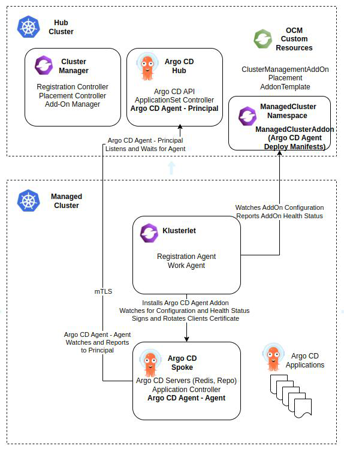

# OCM Argo CD Advanced Pull Model (Argo CD Agent)


## Table of Contents
- [Overview](#overview)
- [Benefits of Using the OCM Argo CD Agent AddOn](#benefits-of-using-the-ocm-argo-cd-agent-addon)
- [Prerequisites](#prerequisites)
- [Setup Guide](#setup-guide)
- [Deploying Applications](#deploying-applications)
- [Additional Resources](#additional-resources)


## Overview

[Open Cluster Management (OCM)](https://open-cluster-management.io/) is a robust, modular,
and extensible platform for orchestrating multiple Kubernetes clusters.
It features an addon framework that allows other projects to develop extensions for managing clusters in custom scenarios.

[Argo CD Agent](https://github.com/argoproj-labs/argocd-agent/) enables a scalable "hub and spokes" GitOps architecture
by offloading compute intensive parts of [Argo CD](https://argoproj.github.io/cd/) (application controller, repository server)
to workload/spoke/managed clusters while maintaining centralized/hub control and observability.

This guide provides instructions for setting up the Argo CD Agent environment within an OCM ecosystem,
leveraging [OCM Addons](https://open-cluster-management.io/docs/concepts/addon/) designed for Argo CD Agent to simplify deployment,
and automate lifecycle management of its components.
Once set up, it will also guide you through deploying applications using the configured environment.



See [argocd-pull-integration](https://github.com/open-cluster-management-io/argocd-pull-integration)
for full details.

## Benefits of Using the OCM Argo CD Agent AddOn

- **Centralized Deployment:** 
With OCM spoke clusters already registered to the OCM hub cluster
 the Argo CD Agent can be deployed to all workload/spoke/managed clusters from a centralized hub.
 Additionally, newly registered OCM spoke clusters will automatically receive the Argo CD Agent deployment,
 eliminating the need for manual deployment.

- **Centralized Lifecycle Management:**
Manage the entire lifecycle of Argo CD Agent instances from the hub cluster.
Easily revoke access to a compromised or malicious agent in a centralized location.

- **Advanced Placement and Rollout:**
Leverage the OCM [Placement API](https://open-cluster-management.io/docs/concepts/placement/)
for advanced placement strategies and controlled rollout of the Argo CD Agent to spoke clusters.

- **Fleet-wide Health Visibility:**
Gain centralized health insights and status views of all Argo CD Agent instances across the entire cluster fleet.

- **Simplified Maintenance:**
Streamline the lifecycle management, upgrades,
and rollbacks of the Argo CD Agent and its components across multiple spoke clusters.

- **Secure Communication:**
The AddOn [Custom Signer](https://open-cluster-management.io/docs/concepts/addon/#custom-signers)
registration type ensures that the Argo CD Agent agent's
client certificates on spoke clusters are automatically signed, enabling secure authentication.
This supports mTLS connections between the agents on spoke clusters and the hub's Argo CD Agent principal component.
Additionally, the AddOn framework handles automatic certificate rotation,
ensuring connections remain secure and free from expiration related disruptions.

- **Flexible Configuration:**
Easily customize the Argo CD Agent deployment using the OCM
[AddOnTemplate](https://open-cluster-management.io/docs/developer-guides/addon/#build-an-addon-with-addon-template).
This eliminates the need for additional coding or maintaining binary compilation pipelines,
enabling efficient templating for deployment modifications.


## Prerequisites

- [Helm CLI](https://helm.sh/).

- Setup an OCM environment with at least two clusters (one hub and at least one managed).
Refer to the [Quick Start guide](https://open-cluster-management.io/docs/getting-started/quick-start/) for more details.

- **The Hub cluster must have a load balancer.**
Refer to the [Additional Resources](#additional-resources) for more details.


## Setup Guide

### Deploy OCM Argo CD AddOn Managers on the Hub Cluster

```shell
# After OCM and load balancer setup:
#
# kubectl config use-context <hub-cluster>
helm repo add ocm https://open-cluster-management.io/helm-charts
helm repo update
helm search repo ocm
helm install argocd-agent-addon ocm/argocd-agent-addon --namespace argocd --create-namespace
```

Validate that the Argo CD Agent AddOn is successfully deployed and available:

```shell
# kubectl config use-context <hub-cluster>
kubectl get managedclusteraddon --all-namespaces

NAMESPACE   NAME                  AVAILABLE   DEGRADED   PROGRESSING
cluster1    argocd-agent-addon    True                   False
```

**This may take a few minutes to complete. Check GitOpsCluster for progress:**

```shell
# kubectl config use-context <hub-cluster>
kubectl -n argocd get gitopscluster gitops-cluster -o yaml
...
  - lastTransitionTime: "2025-10-30T03:38:38Z"
    message: Addon configured for 1 clusters
    observedGeneration: 2
    reason: Success
    status: "True"
    type: AddonConfigured
```

On the hub cluster, validate that the Argo CD Agent principal pod is running successfully:

```shell
# kubectl config use-context <hub-cluster>
kubectl -n argocd get pod

NAME                                                       READY   STATUS    RESTARTS   AGE
...
argocd-agent-principal-5c47c7c6d5-mpts4                    1/1     Running   0          88s
```

On the managed cluster, validate that the Argo CD Agent agent pod is running successfully:
```shell
# kubectl config use-context <managed-cluster>
kubectl -n argocd get pod

NAME                                                   READY   STATUS    RESTARTS   AGE
...
argocd-agent-agent-68bdb5dc87-7zb4h                    1/1     Running   0          88s
```

## Deploying Applications

### Managed Mode

Refer to the [Argo CD Agent website](https://argocd-agent.readthedocs.io/latest/concepts/agent-modes/)
for more details about the `managed` mode.

To deploy an Argo CD Application in `managed` mode using the Argo CD Agent,
first propagate an AppProject from `hub` cluster to the managed cluster by creating or updating a `hub` AppProject

```shell
# kubectl config use-context <hub-cluster>
kubectl apply -f - <<EOF
apiVersion: argoproj.io/v1alpha1
kind: AppProject
metadata:
  name: default
  namespace: argocd
spec:
  clusterResourceWhitelist:
    - group: '*'
      kind: '*'
  destinations:
    - namespace: '*'
      server: '*'
  sourceNamespaces:
    - '*'
  sourceRepos:
    - '*'
EOF
```

then create the application on the **hub cluster**:

```shell
# kubectl config use-context <hub-cluster>
kubectl apply -f - <<EOF
apiVersion: argoproj.io/v1alpha1
kind: Application
metadata:
  name: guestbook
  namespace: cluster1 # replace with managed cluster name
spec:
  project: default
  source:
    repoURL: https://github.com/argoproj/argocd-example-apps
    targetRevision: HEAD
    path: guestbook
  destination:
    server: https://172.18.255.200:443?agentName=cluster1 # Replace with https://<principal-external-ip:port>?agentName=<managed-cluster-name>
    namespace: guestbook
  syncPolicy:
    syncOptions:
    - CreateNamespace=true
    automated:
      prune: true
EOF
```

Validate that the Argo CD AppProject and Application has been successfully propagated to the **managed cluster**:

```shell
# kubectl config use-context <managed-cluster>
kubectl -n argocd get appproj

NAME      AGE
default   88s

kubectl -n argocd get app

NAME        SYNC STATUS   HEALTH STATUS
guestbook   Synced        Healthy
```

Validate that the application has been successfully synchronized back to the **hub cluster**:

```shell
# kubectl config use-context <hub-cluster>
kubectl -n cluster1 get app

NAME        SYNC STATUS   HEALTH STATUS
guestbook   Synced        Healthy
```

## Additional Resources

### Deploy MetalLB on a KinD Cluster

Run the following commands to install MetalLB on a KinD cluster:

```shell
# kubectl config use-context <hub-cluster>
kubectl apply -f https://raw.githubusercontent.com/metallb/metallb/main/config/manifests/metallb-native.yaml
kubectl wait --namespace metallb-system \
  --for=condition=Ready pods \
  --selector=app=metallb \
  --timeout=120s
cat <<EOF | kubectl apply -f -
apiVersion: metallb.io/v1beta1
kind: IPAddressPool
metadata:
  name: kind-address-pool
  namespace: metallb-system
spec:
  addresses:
  - 172.18.255.200-172.18.255.250 # Replace with the IP range of your choice
---
apiVersion: metallb.io/v1beta1
kind: L2Advertisement
metadata:
  name: kind-l2-advertisement
  namespace: metallb-system
spec:
  ipAddressPools:
  - kind-address-pool
EOF
```
