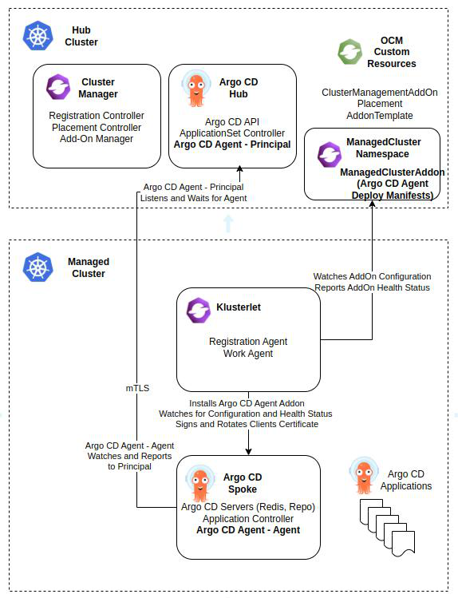

# OCM Argo CD Advanced Pull Model (Argo CD Agent)


## Table of Contents
- [Overview](#overview)
- [Benefits of Using the OCM Argo CD Agent AddOn](#benefits-of-using-the-ocm-argo-cd-agent-addon)
- [Prerequisites](#prerequisites)
- [Setup Guide](#setup-guide)
- [Deploying Applications](#deploying-applications)
- [Troubleshooting](#troubleshooting)
- [Additional Resources](#additional-resources)


## Overview

[Open Cluster Management (OCM)](https://open-cluster-management.io/) is a robust, modular,
and extensible platform for orchestrating multiple Kubernetes clusters.
It features an addon framework that allows other projects to develop extensions for managing clusters in custom scenarios.

[Argo CD Agent](https://github.com/argoproj-labs/argocd-agent/) enables a scalable "hub and spokes" GitOps architecture
by offloading compute intensive parts of [Argo CD](https://argoproj.github.io/cd/) (application controller, repository server)
to workload/spoke/managed clusters while maintaining centralized/hub control and observability.

This guide provides instructions for setting up the Argo CD Agent environment within an OCM ecosystem,
leveraging [OCM Addons](https://open-cluster-management.io/docs/concepts/addon/) designed for Argo CD Agent to simplify deployment,
and automate lifecycle management of its components.
Once set up, it will also guide you through deploying applications using the configured environment.



See [argocd-pull-integration](https://github.com/open-cluster-management-io/argocd-pull-integration)
for full details.

## Benefits of Using the OCM Argo CD Agent AddOn

- **Centralized Deployment:** 
With OCM spoke clusters already registered to the OCM hub cluster
 the Argo CD Agent can be deployed to all workload/spoke/managed clusters from a centralized hub.
 Additionally, newly registered OCM spoke clusters will automatically receive the Argo CD Agent deployment,
 eliminating the need for manual deployment.

- **Centralized Lifecycle Management:**
Manage the entire lifecycle of Argo CD Agent instances from the hub cluster.
Easily revoke access to a compromised or malicious agent in a centralized location.

- **Advanced Placement and Rollout:**
Leverage the OCM [Placement API](https://open-cluster-management.io/docs/concepts/placement/)
for advanced placement strategies and controlled rollout of the Argo CD Agent to spoke clusters.

- **Fleet-wide Health Visibility:**
Gain centralized health insights and status views of all Argo CD Agent instances across the entire cluster fleet.

- **Simplified Maintenance:**
Streamline the lifecycle management, upgrades,
and rollbacks of the Argo CD Agent and its components across multiple spoke clusters.

- **Secure Communication:**
The AddOn [Custom Signer](https://open-cluster-management.io/docs/concepts/addon/#custom-signers)
registration type ensures that the Argo CD Agent agent's
client certificates on spoke clusters are automatically signed, enabling secure authentication.
This supports mTLS connections between the agents on spoke clusters and the hub's Argo CD Agent principal component.
Additionally, the AddOn framework handles automatic certificate rotation,
ensuring connections remain secure and free from expiration related disruptions.

- **Flexible Configuration:**
Easily customize the Argo CD Agent deployment using the OCM
[AddOnTemplate](https://open-cluster-management.io/docs/developer-guides/addon/#build-an-addon-with-addon-template).
This eliminates the need for additional coding or maintaining binary compilation pipelines,
enabling efficient templating for deployment modifications.


## Prerequisites

- [clusteradm CLI](https://open-cluster-management.io/docs/getting-started/quick-start/#install-clusteradm-cli-tool).

- Setup an OCM environment with at least two clusters (one hub and at least one managed).
Refer to the [Quick Start guide](https://open-cluster-management.io/docs/getting-started/quick-start/) for more details.

- **The Hub cluster must have a load balancer.**
Refer to the [Additional Resources](#additional-resources) for more details.

- **The `argocd` namespace on the hub must not already contain any Argo CD resources at all.**
The `argocd-agent` hub addon installs the [Argo CD Operator](https://github.com/argoproj-labs/argocd-operator)
and manages its own dedicated `ArgoCD` custom resource (named `argocd`, in the `argocd` namespace) with
`spec.controller.enabled: false` — the principal component takes the place of the application controller on the hub.
This is **not compatible** with any pre-existing plain/community Argo CD install in the same namespace (e.g. from
[`deploy-argocd-apps`](../deploy-argocd-apps) or [`deploy-argocd-apps-pull`](../deploy-argocd-apps-pull)), **even one
with its own application controller disabled** — the Operator still creates resources named `argocd-server`,
`argocd-repo-server`, etc. regardless of `controller.enabled`, and those will collide with a pre-existing install's
same-named resources either way. There is no supported/tested way to run this addon alongside an existing Argo CD
instance in the same namespace; require the `argocd` namespace to be empty of Argo CD resources before installing.
If you have an existing Argo CD install in the `argocd` namespace on your hub, remove it first — how depends on how
it was installed:
  - Installed via `clusteradm install hub-addon --names argocd` (the [`deploy-argocd-apps-pull`](../deploy-argocd-apps-pull)
    model): run `clusteradm uninstall hub-addon --names argocd`. This only removes the addon's own
    `ClusterManagementAddOn`/controller, not the underlying plain Argo CD it was installed on top of — still
    follow up with the raw-manifest cleanup below for that part.
  - Installed via raw manifests, e.g. `kubectl apply -f .../argo-cd/stable/manifests/install.yaml` (the
    [`deploy-argocd-apps`](../deploy-argocd-apps) model): there is no `ClusterManagementAddOn` to uninstall here —
    `clusteradm uninstall hub-addon` is a no-op for this install method. Delete the same manifest you applied it
    with, e.g. `kubectl delete -n argocd -f https://raw.githubusercontent.com/argoproj/argo-cd/stable/manifests/install.yaml`
    — this is the safest option, since it only removes the Argo CD components themselves (`argocd-server`,
    `argocd-repo-server`, etc.) and leaves any `Application`/`AppProject` objects you may have created untouched.
    If you don't have the exact manifest you installed with, `kubectl delete deployments,statefulsets,services -n argocd -l app.kubernetes.io/part-of=argocd`
    removes the same component resources without touching `Application`/`AppProject` objects. Deleting
    `Application`/`AppProject` objects themselves is a separate, deliberate decision — don't fold it into this
    cleanup step, since they represent your actual GitOps state; review and confirm each one is disposable before
    running `kubectl delete application(s)/appproject(s) <name> -n argocd` individually.

Deleting the whole `argocd` namespace (`kubectl delete namespace argocd`) also works for either case, but it removes
**everything** in that namespace — including any `Application`/`AppProject` objects, credentials, and PKI
secrets you may still need — not just the conflicting Argo CD install. Only do this if you've confirmed
(and backed up anything important) that the namespace is fully disposable.

> **PKI is fully automatic — no `argocd-agentctl` needed.** The `argocd-agent` principal component requires
> four secrets to start (a CA certificate, its own gRPC TLS certificate, a resource-proxy TLS certificate, and a
> JWT signing key). As of the addon version installed by `clusteradm install hub-addon --names argocd-agent`
> today (`argocd-pull-integration` v0.28.1 and later), the `GitOpsCluster` controller generates and manages all
> four of these itself — you do **not** need to install the `argocd-agentctl` CLI or run any manual PKI commands.
> Confirmed by re-testing end-to-end on a clean cluster with zero `argocd-agentctl` commands: the controller's
> logs show `Successfully ensured ArgoCD agent CA certificate` / `... principal TLS certificate` / `... resource
> proxy TLS certificate`, and `kubectl -n argocd get gitopscluster gitops-cluster -o yaml` reports
> `CACertificateReady`, `PrincipalCertificateReady`, `ResourceProxyCertificateReady`, and `JWTSecretReady` all
> `True`. If you see the principal crash-loop with a "secret not found" error anyway, that almost always means
> the controller responsible for creating these secrets isn't running yet — see
> [Troubleshooting](#principal-pod-crash-loops-with-a-missing-tlsjwt-secret) below, not a missing manual step.

## Setup Guide

### Deploy OCM Argo CD Agent AddOn on the Hub Cluster

```shell
# After OCM and load balancer setup:
#
# kubectl config use-context <hub-cluster>
clusteradm install hub-addon --names argocd-agent --create-namespace
```

Validate that the Argo CD Agent AddOn is successfully deployed and available:

```shell
# kubectl config use-context <hub-cluster>
kubectl get managedclusteraddon --all-namespaces

NAMESPACE   NAME                  AVAILABLE   DEGRADED   PROGRESSING
cluster1    argocd-agent-addon    True                   False
```

**This may take a few minutes to complete. Check GitOpsCluster for progress:**

```shell
# kubectl config use-context <hub-cluster>
kubectl -n argocd get gitopscluster gitops-cluster -o yaml
...
  - lastTransitionTime: "2025-10-30T03:38:38Z"
    message: Addon configured for 1 clusters
    observedGeneration: 2
    reason: Success
    status: "True"
    type: AddonConfigured
```

On the hub cluster, validate that the Argo CD Agent principal pod is running successfully:

```shell
# kubectl config use-context <hub-cluster>
kubectl -n argocd get pod

NAME                                                       READY   STATUS    RESTARTS   AGE
...
argocd-agent-principal-5c47c7c6d5-mpts4                    1/1     Running   0          88s
```

On the managed cluster, validate that the Argo CD Agent agent pod is running successfully:
```shell
# kubectl config use-context <managed-cluster>
kubectl -n argocd get pod

NAME                                                   READY   STATUS    RESTARTS   AGE
...
argocd-agent-agent-68bdb5dc87-7zb4h                    1/1     Running   0          88s
```

## Deploying Applications

### Managed Mode

Refer to the [Argo CD Agent website](https://argocd-agent.readthedocs.io/latest/concepts/agent-modes/)
for more details about the `managed` mode.

> **Note on Application mapping:** the OCM `argocd-agent` addon configures the principal with
> [`destinationBasedMapping: true`](https://argocd-agent.readthedocs.io/latest/concepts/agent-mapping/#destination-based-mapping).
> In this mode, the principal routes `Application` resources to the correct agent using **`spec.destination.name`**
> (the target managed cluster's name) — it does **not** use `spec.destination.server`, and the namespace the
> `Application` lives in on the hub does not need to match the target cluster's name either (though the examples
> below still use a per-cluster namespace for organizational clarity, matching the addon's own conventions).
> Setting `destination.server` with an `?agentName=<cluster>` query string (as some older docs suggest) is silently
> ignored by a principal running in this mode — the `Application` will never sync and the principal's logs will show
> no activity for it at all.

To deploy an Argo CD Application in `managed` mode using the Argo CD Agent,
first propagate an AppProject from `hub` cluster to the managed cluster by creating or updating a `hub` AppProject

```shell
# kubectl config use-context <hub-cluster>
kubectl apply -f - <<EOF
apiVersion: argoproj.io/v1alpha1
kind: AppProject
metadata:
  name: default
  namespace: argocd
spec:
  clusterResourceWhitelist:
    - group: '*'
      kind: '*'
  destinations:
    - namespace: '*'
      server: '*'
  sourceNamespaces:
    - '*'
  sourceRepos:
    - '*'
EOF
```

then create the target namespace on the managed cluster and the application on the **hub cluster**:

```shell
# Create the target namespace on the managed cluster
# kubectl config use-context <managed-cluster>
kubectl create namespace guestbook

# Create the application on the hub cluster
# kubectl config use-context <hub-cluster>
kubectl apply -f - <<EOF
apiVersion: argoproj.io/v1alpha1
kind: Application
metadata:
  name: guestbook
  namespace: cluster1 # replace with managed cluster name
spec:
  project: default
  source:
    repoURL: https://github.com/argoproj/argocd-example-apps
    targetRevision: HEAD
    path: guestbook
  destination:
    name: cluster1 # Replace with the managed cluster name; do NOT use `server` here, see note above
    namespace: guestbook
  syncPolicy:
    automated:
      prune: true
EOF
```

Validate that the Argo CD AppProject and Application has been successfully propagated to the **managed cluster**:

```shell
# kubectl config use-context <managed-cluster>
kubectl -n argocd get appproj

NAME      AGE
default   88s

kubectl -n argocd get app

NAME        SYNC STATUS   HEALTH STATUS
guestbook   Synced        Healthy
```

Validate that the application has been successfully synchronized back to the **hub cluster**:

```shell
# kubectl config use-context <hub-cluster>
kubectl -n cluster1 get app

NAME        SYNC STATUS   HEALTH STATUS
guestbook   Synced        Healthy
```

## Troubleshooting

### `ImagePullBackOff` on `argocd-pull-integration-controller` (Apple Silicon / arm64)

**Symptom:** the `argocd-pull-integration-controller` deployment in the hub's `argocd` namespace stays in
`ImagePullBackOff`, and `kubectl -n argocd describe pod -l control-plane=argocd-pull-integration-controller` shows:

```text
Failed to pull image "quay.io/open-cluster-management/argocd-pull-integration:<tag>":
rpc error: code = NotFound desc = failed to pull and unpack image "...": no match for platform in manifest: not found
```

**Root cause:** this depends on the exact image tag your addon chart pins, not on the solution itself — a
future release may add `linux/arm64` support and make this workaround unnecessary. Before doing anything
else, find the tag actually being used and check it yourself:

```shell
# find the tag your install actually pulled
kubectl get deployment argocd-pull-integration-controller -n argocd -o jsonpath='{.spec.template.spec.containers[0].image}'

# check whether THAT tag has a linux/arm64 variant published (not just any arm64 platform)
docker manifest inspect quay.io/open-cluster-management/argocd-pull-integration:<the-tag-from-above> | \
  jq -e '.manifests[]? | select(.platform.os=="linux" and .platform.architecture=="arm64")'
# no jq? grep -B1 '"architecture": "arm64"' on the same output and check the line above it says "os": "linux"
```

If that doesn't return a match, the pod will `ImagePullBackOff` on Apple Silicon / arm64 hosts.
`argocd-pull-integration-controller` is the component that watches the `GitOpsCluster`/`Placement` resources
and generates the `AddOnTemplate` that tells OCM's addon framework what to actually deploy to each managed
cluster. It is also the component that automatically generates the principal's PKI secrets (see
[Principal pod crash-loops with a missing TLS/JWT secret](#principal-pod-crash-loops-with-a-missing-tlsjwt-secret)
below). Without it running, `ManagedClusterAddOn`s for `argocd-agent-addon` will never progress past
`Progressing: False / Waiting for ManifestApplied`, and the principal pod will crash-loop on missing secrets,
on any architecture where this image can't run.

**Workaround:** build a native `arm64` image from source and load it into your KinD nodes so `kubelet`'s
`IfNotPresent` pull policy uses the local image instead of pulling from the registry. Replace `<tag>` below
with the exact tag you found above (do **not** build from `main`, which can be ahead of the last release
and would then get mislabeled as that release):

```shell
git clone https://github.com/open-cluster-management-io/argocd-pull-integration.git
cd argocd-pull-integration
git checkout <tag>   # must be the same tag you checked above and use below
docker build --platform linux/arm64 -t quay.io/open-cluster-management/argocd-pull-integration:<tag> .

# Load into every KinD node that runs a copy of this image (hub, and any managed cluster
# using the argocd-agent-addon), matching the tag your addon chart expects:
kind load docker-image quay.io/open-cluster-management/argocd-pull-integration:<tag> --name <cluster-name>
```

Then restart the affected pod(s) (`kubectl -n argocd delete pod -l control-plane=argocd-pull-integration-controller`,
and similarly for the addon's deployment on each managed cluster) so they pick up the locally-loaded image.

### Principal pod crash-loops with a missing TLS/JWT secret

**Symptom:** `argocd-agent-principal` is stuck in `Error`/`CrashLoopBackOff`, with logs like
`[FATAL]: Could not load resource proxy TLS configuration` or `could not read JWT secret argocd/argocd-agent-jwt: ... not found`.

**Cause and fix:** these four secrets (CA, principal TLS, resource-proxy TLS, JWT) are generated automatically by
the `argocd-pull-integration-controller` deployment in the `argocd` namespace, as part of it reconciling the
`GitOpsCluster` resource — nothing needs to be created manually. If the principal is crash-looping on a missing
secret, it almost always means that controller isn't running yet. Check it first:

```shell
# kubectl config use-context <hub-cluster>
kubectl -n argocd get pod -l app.kubernetes.io/name=argocd-pull-integration-controller
```

If it's not `Running` (e.g. `ImagePullBackOff`), fix that first — see the arm64 entry above, which is the most
common reason this happens on Apple Silicon/arm64 hosts — and the PKI secrets will appear on their own once it
starts. If it *is* `Running`, check its logs for errors
(`kubectl -n argocd logs deploy/argocd-pull-integration-controller`) and the `GitOpsCluster` status
(`kubectl -n argocd get gitopscluster gitops-cluster -o yaml`) for which specific condition
(`CACertificateReady`, `PrincipalCertificateReady`, `ResourceProxyCertificateReady`, `JWTSecretReady`) isn't
`True`. Once the secrets exist, delete the principal pod so it picks them up:
`kubectl -n argocd delete pod -l app.kubernetes.io/name=argocd-agent-principal`.

### `Application` never syncs, no activity in principal logs

**Symptom:** an `Application` created on the hub shows no `SYNC STATUS`/`HEALTH STATUS` at all, and grepping the
principal's logs (`kubectl -n argocd logs deploy/argocd-agent-principal`) for the application's name returns nothing.

**Cause and fix:** see the [Application mapping note](#managed-mode) above — use `spec.destination.name` instead
of `spec.destination.server`.

## Additional Resources

### Deploy MetalLB on a KinD Cluster

Run the following commands to install MetalLB on a KinD cluster:

```shell
# kubectl config use-context <hub-cluster>
kubectl apply -f https://raw.githubusercontent.com/metallb/metallb/main/config/manifests/metallb-native.yaml
kubectl wait --namespace metallb-system \
  --for=condition=Ready pods \
  --selector=app=metallb \
  --timeout=120s
cat <<EOF | kubectl apply -f -
apiVersion: metallb.io/v1beta1
kind: IPAddressPool
metadata:
  name: kind-address-pool
  namespace: metallb-system
spec:
  addresses:
  - 172.18.255.200-172.18.255.250 # Replace with the IP range of your choice
---
apiVersion: metallb.io/v1beta1
kind: L2Advertisement
metadata:
  name: kind-l2-advertisement
  namespace: metallb-system
spec:
  ipAddressPools:
  - kind-address-pool
EOF
```
