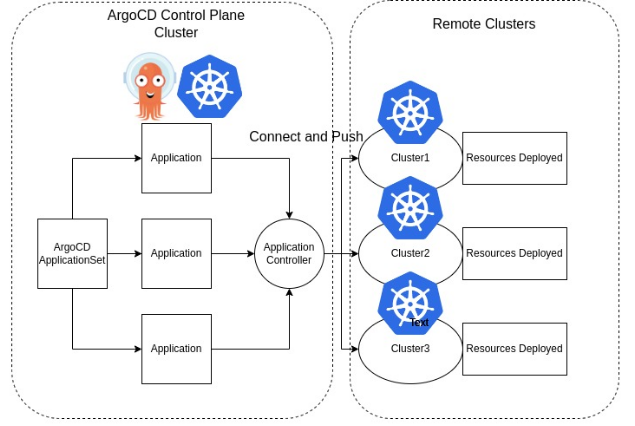
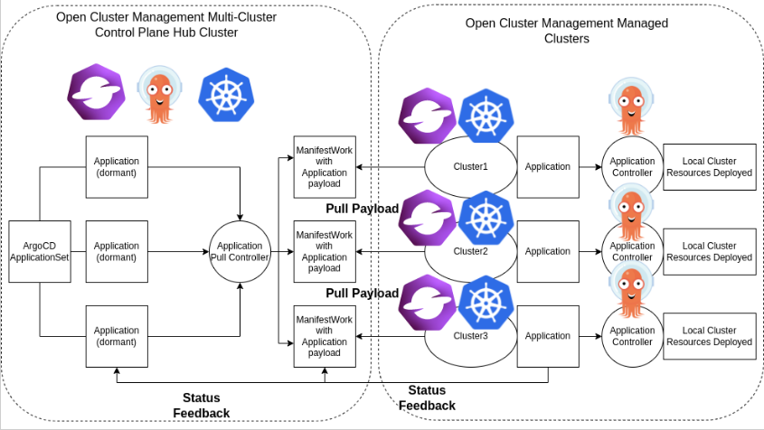

# ArgoCD Application Pull Controller
The [ArgoCD](https://argo-cd.readthedocs.io/en/stable/) application controller uses the hub-spoke pattern or pull model mechanism for decentralized resource delivery to remote clusters.
By using [Open Cluster Management (OCM)](https://open-cluster-management.io/) APIs and components, 
the ArgoCD Applications will be pulled from the multi-cluster control plane hub cluster down to 
the registered OCM managed clusters. To try it out, check out the [Getting Started Guide](getting-started.md).

## Overview
The current ArgoCD resource delivery is primarily pushing resources from a centralized cluster to the remote/managed clusters.

By using this controller, users can have a pull model resource delivery mechanism.

The pull model may offers some advantages over the existing push model:
- Scalability: hub-spoke pattern may offers better scalability.
- Security: cluster credentials doesn't have to be stored in a centralized environment may enhance security.
- It may reduce the impact of a single point of centralized failure.

This ArgoCD pull model controller on the Hub cluster will create [ManifestWork](https://open-cluster-management.io/concepts/manifestwork/) objects wrapping Application objects as payload.
The OCM agent on the Managed cluster will see the ManifestWork on the Hub cluster and pull the Application down.
