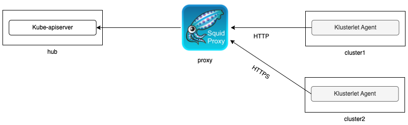

# Join hub through a forward proxy server

This doc shows how a cluster joins an Open Cluster Management (OCM) hub cluster through a forward proxy server. 

## Prerequisite

- [kind](https://kind.sigs.k8s.io) must be installed on your local machine. The Kubernetes version must be >= 1.19, see [kind user guide](https://kind.sigs.k8s.io/docs/user/quick-start/#creating-a-cluster) for more details.

- Download and install [clusteradm](https://github.com/open-cluster-management-io/clusteradm/releases). For Linux OS, run the following commands:

    ```
    wget -qO- https://github.com/open-cluster-management-io/clusteradm/releases/latest/download/clusteradm_linux_amd64.tar.gz | sudo tar -xvz -C /usr/local/bin/

    sudo chmod +x /usr/local/bin/clusteradm
    ```
    Note: In order to run the scripts provided in this doc successfully, the clusteradm version must be > 0.7.1. You can also build it from the latest [source code](https://github.com/open-cluster-management-io/clusteradm) that contains the desired feature.

## Setup the proxy server

Run `./setup-proxy.sh`. It creates a Kind cluster and runs an open source proxy server [squid](http://www.squid-cache.org/) on it. HTTP GET method is enabled on this proxy server and it is serving on ports 31280 and 31290 for HTTP and HTTPS service respectively.
```bash
kubectl -n squid get svc -o wide
NAME    TYPE       CLUSTER-IP     EXTERNAL-IP   PORT(S)                         AGE     SELECTOR
squid   NodePort   10.96.223.82   <none>        3128:31280/TCP,3129:31290/TCP   3h49m   app=squid
```

## Setup OCM hub cluster and managed clusters

Run `./setup-ocm.sh` to create three Kind clusters:
- `hub`, the cluster on which the OCM hub is running;
- `cluster1`, it joins the hub cluster through the HTTP proxy;
- `cluster2`, it joins the hub cluster through the HTTPS proxy;

Once it is completed, `cluster1` and `cluster2` successfully join the hub cluster through the forward proxy server.
```bash
$ kubectl get managedcluster
NAME       HUB ACCEPTED   MANAGED CLUSTER URLS                  JOINED   AVAILABLE   AGE
cluster1   true           https://cluster1-control-plane:6443   True     True        111s
cluster2   true           https://cluster2-control-plane:6443   True     True        44s
```


## Troubleshooting

1. Check if the `bootstrap-hub-kubeconfig` and `hub-kubeconfig-secret` contains the proxy settings

During bootstrapping, the Klusterlet agent uses the `bootstrap-hub-kubeconfig` to connect to the hub cluster. The proxy settings should be included in this kubeconfig.
```bash
kubectl -n open-cluster-management-agent get secret bootstrap-hub-kubeconfig -o jsonpath='{.data.kubeconfig}' | base64 -d | grep proxy-url
    proxy-url: http://proxy-control-plane:31280
```
Once the cluster registered to the hub cluster, the generated `hub-kubeconfig-secret` should also include the same proxy settings.
```bash
kubectl -n open-cluster-management-agent get secret hub-kubeconfig-secret -o jsonpath='{.data.kubeconfig}' | base64 -d | grep proxy-url
    proxy-url: http://proxy-control-plane:31280
```
If you enabled any add-on, the generated hub kubeconfig for add-on will have this proxy settings as well.

2. Check if the proxy CA certificate is included in the `bootstrap-hub-kubeconfig` and `hub-kubeconfig-secret`.

If HTTPS proxy is used, the CA certificate of the proxy server should be appended to the `certificate-authority-data` of the `bootstrap-hub-kubeconfig` and `hub-kubeconfig-secret` secret.

```bash
kubectl -n open-cluster-management-agent get secret bootstrap-hub-kubeconfig -o jsonpath='{.data.kubeconfig}' | base64 -d | grep certificate-authority-data | awk '{print $2}' | base64 -d
-----BEGIN CERTIFICATE-----
MIIC/jCCA...O62WrVM=
-----END CERTIFICATE-----
-----BEGIN CERTIFICATE-----
MIIDDTCCA...INDFwtk=
-----END CERTIFICATE-----
```
