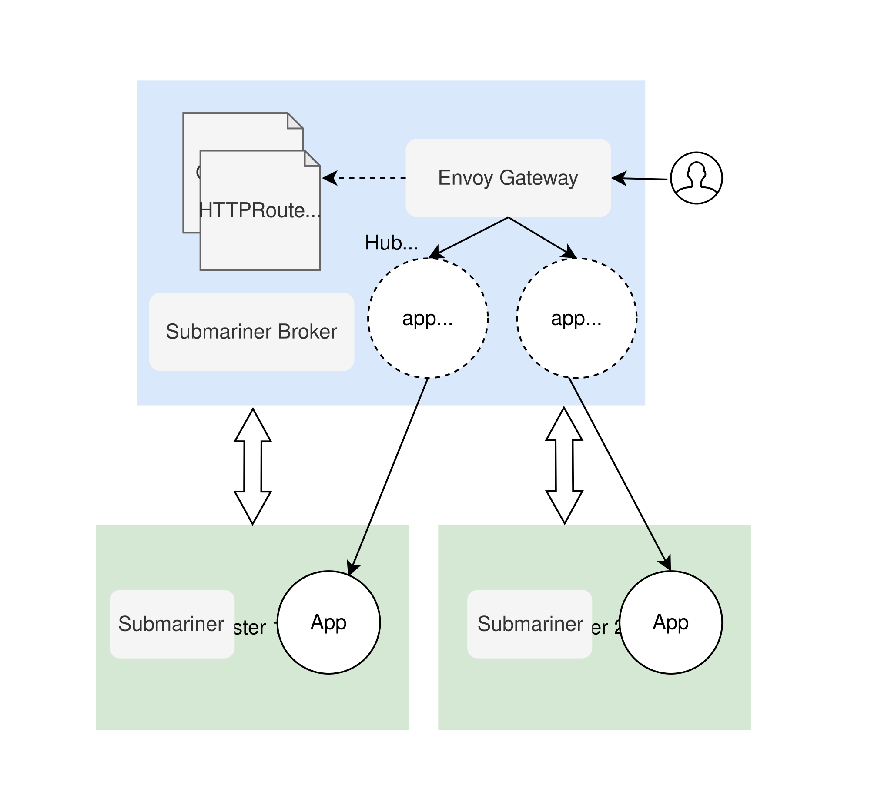

# Set up a Multi-Cluster Gateway on OCM

This guide will walk you through setting up a multi-cluster gateway with Open Cluster Management (OCM) using the [Envoy Gateway](https://gateway.envoyproxy.io/). This guide quickly boots three Kind clusters (hub, cluster1, and cluster2) on your local machine. Then, it installs the Gateway API CRDs and Envoy Gateway on the hub cluster. As a prerequisite, we employ [Submariner](https://submariner.io/) to create the multicluster environment, facilitating service export from the hub cluster to managed clusters.



## Set up OCM Dev Environment

Set up the dev environment with three Kind clusters (hub, cluster1, and cluster2) in your local machine following [setup dev environment](../setup-dev-environment).

## Connect Clusters with Submariner

Install [subctl](https://submariner.io/operations/deployment/subctl/) and deploy multicluster service API and Submariner for cross-cluster traffic (from hub to managed clusters) using ServiceImport.

Correct the kubeconfig master IP address before deploying Submariner:

```bash
export HUB_MASTER_IP=$(docker inspect -f '{{range .NetworkSettings.Networks}}{{.IPAddress}}{{end}}' hub-control-plane)
export CLUSTER1_MASTER_IP=$(docker inspect -f '{{range .NetworkSettings.Networks}}{{.IPAddress}}{{end}}' cluster1-control-plane)
export CLUSTER2_MASTER_IP=$(docker inspect -f '{{range .NetworkSettings.Networks}}{{.IPAddress}}{{end}}' cluster2-control-plane)
kubectl config set-cluster kind-hub --server=https://${HUB_MASTER_IP}:6443
kubectl config set-cluster kind-cluster1 --server=https://${CLUSTER1_MASTER_IP}:6443
kubectl config set-cluster kind-cluster2 --server=https://${CLUSTER2_MASTER_IP}:6443
```

Deploy Submariner with globalnet enabled:

```bash
subctl deploy-broker --context kind-hub --globalnet
subctl join --context kind-hub broker-info.subm --clusterid hub --natt=false
subctl join --context kind-cluster1 broker-info.subm --clusterid cluster1 --natt=false
subctl join --context kind-cluster2 broker-info.subm --clusterid cluster2 --natt=false
```

## Install Envoy Gateway on Hub Cluster

Install the Gateway API CRDs and Envoy Gateway in hub cluster:

```bash
helm install eg oci://docker.io/envoyproxy/gateway-helm --version v1.0.1 -n envoy-gateway-system --create-namespace --kube-context kind-hub
```

Wait for Envoy Gateway to become available:

```bash
kubectl wait --timeout=5m -n envoy-gateway-system deployment/envoy-gateway --for=condition=Available --context kind-hub
```

## Deploy Nginx Default Backend to Managed Clusters

Deploy the nginx default-backend application to both managed clusters using [ManifestWork](https://open-cluster-management.io/docs/concepts/work-distribution/manifestwork/):

```bash
kubectl apply -f manifests/nginx-application --context kind-hub
```

Wait for the deployments to be available on the managed clusters:

```bash
kubectl wait --timeout=2m deployment/nginx-default-backend --for=condition=Available --context kind-cluster1
kubectl wait --timeout=2m deployment/nginx-default-backend --for=condition=Available --context kind-cluster2
```

Export the nginx application with subctl command:

```bash
subctl export service nginx-default-backend -n default --context kind-cluster1
subctl export service nginx-default-backend -n default --context kind-cluster2
```

## Create Gateway API Objects

Create the Gateway API objects GatewayClass, Gateway and HTTPRoute in hub cluster to set up the routing:

```bash
sed "s|nginx-ingress-1-default-backend|nginx-default-backend|g" manifests/gateway/httproute.yaml | \
  sed "s|nginx-ingress-2-default-backend|nginx-default-backend|g" | \
  kubectl apply --context kind-hub -f -
kubectl apply -f manifests/gateway/gatewayclass.yaml -f manifests/gateway/gateway.yaml -f manifests/gateway/referencegrant.yaml --context kind-hub
```

## Verify the Multi-Cluster Gateway

Get the name of the Envoy service created by the example Gateway:

```bash
kubectl wait --timeout=2m -n envoy-gateway-system svc -l gateway.envoyproxy.io/owning-gateway-name=eg --for=jsonpath='{.metadata.name}' --context kind-hub
export ENVOY_SERVICE=$(kubectl get svc -n envoy-gateway-system --selector=gateway.envoyproxy.io/owning-gateway-namespace=default,gateway.envoyproxy.io/owning-gateway-name=eg -o jsonpath='{.items[0].metadata.name}' --context kind-hub)
```

Port forward to the Envoy service:

```bash
kubectl --context kind-hub -n envoy-gateway-system port-forward service/${ENVOY_SERVICE} 8888:80 &
```

Curl the example nginx default backend through Envoy proxy:

```bash
curl --verbose --header "Host: www.example.com" http://localhost:8888/healthz
```

## Cleanup

Delete all Kind clusters created by this demo:

```bash
kind delete cluster --name hub
kind delete cluster --name cluster1
kind delete cluster --name cluster2
```
