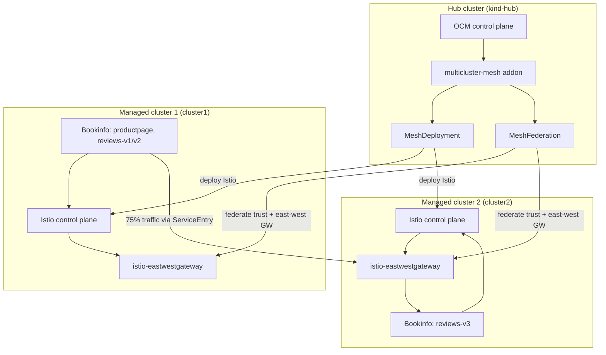

# Set up a Multicluster Service Mesh on OCM

This solution sets up a multicluster service mesh on top of OCM. The guide bootstraps 3 Kind clusters (hub, cluster1, and cluster2) on your local machine and then deploys the [multicluster mesh addon](https://github.com/open-cluster-management-io/multicluster-mesh). After that, it creates service meshes from the hub to the managed clusters and finally federates the service meshes so that microservices deployed into different managed clusters can access each other.

Optional automation scripts (`setup-mesh-addon.sh`, `verify-bookinfo-traffic.sh`, `cleanup.sh`) mirror the manual steps below.

## Architecture

OCM manages cluster registration and work distribution. The multicluster-mesh addon translates high-level mesh CRs on the hub into Istio resources on managed clusters.



### Key resources

| Resource | Purpose |
|---|---|
| `MeshDeployment` | Deploy Istio control planes to selected managed clusters from the hub |
| `MeshFederation` | Establish trust and east-west gateways between mesh peers |
| `ServiceEntry` | Export/import remote services across federated meshes |
| `VirtualService` | Split traffic between local and remote review services |

## Prerequisite

Clone remote repo and cd to service mesh dir
```bash
git clone https://github.com/open-cluster-management-io/ocm.git
cd ./ocm/solutions/run-multicluster-servicemesh
```

Set up the dev environment in your local machine following [setup dev environment](https://github.com/open-cluster-management-io/ocm/tree/main/solutions/setup-dev-environment).

```bash
../setup-dev-environment/local-up.sh
```

## Install Multicluster Service Mesh Addon on OCM

1. Install the multicluster-mesh addon with helm chart:

```bash
git clone https://github.com/open-cluster-management-io/multicluster-mesh.git
helm install \
    -n open-cluster-management-addon --create-namespace \
    multicluster-mesh ./multicluster-mesh/charts/multicluster-mesh
```

2. You will see that all `managedclusteraddon` are available after waiting a while:

```bash
$ kubectl get managedclusteraddon --all-namespaces
NAMESPACE   NAME                  AVAILABLE   DEGRADED   PROGRESSING
cluster1    multicluster-mesh     True
cluster2    multicluster-mesh     True
```

## Deploy service meshes from Hub

1. Deploy the service meshes from Hub to managed clusters:

```bash
kubectl apply -f ./manifests/meshdeployment.yaml
```

2. You will see that the control plane for the service meshes are up and running in managed clusters after a while:

```bash
# kubectl config use-context kind-cluster1
Switched to context "kind-cluster1".
# kubectl -n istio-system get pod
NAME                                     READY   STATUS    RESTARTS   AGE
istio-ingressgateway-6f87f4f86c-gt4tr    1/1     Running   0          19s
istio-operator-1-16-7-858b59bdb8-zpj5g   1/1     Running   0          53s
istiod-1-16-7-67b8bf75f8-28lrl           1/1     Running   0          28s
# kubectl config use-context kind-cluster2
Switched to context "kind-cluster2".
# kubectl -n istio-system get pod
NAME                                     READY   STATUS    RESTARTS   AGE
istio-ingressgateway-6f87f4f86c-jrs9k    1/1     Running   0          21s
istio-operator-1-16-7-858b59bdb8-d9xgs   1/1     Running   0          53s
istiod-1-16-7-67b8bf75f8-qk4rd           1/1     Running   0          32s
```

## Federate Service Meshes from Hub

From the hub cluster, federate the service meshes created in the last step by creating a MeshFederation resource:

```bash
kubectl config use-context kind-hub
kubectl apply -f ./manifests/meshfederation.yaml
```

## Verify Mesh Federation with Bookinfo Application

1. Deploy part(productpage,details,reviews-v1,reviews-v2,ratings) of the bookinfo application in cluster1:

```bash
kubectl config use-context kind-cluster1
kubectl create ns bookinfo
kubectl label namespace bookinfo istio.io/rev=1-16-7
kubectl apply -n bookinfo -f https://raw.githubusercontent.com/istio/istio/release-1.16/samples/bookinfo/platform/kube/bookinfo.yaml -l 'app,version notin (v3)'
kubectl apply -n bookinfo -f https://raw.githubusercontent.com/istio/istio/release-1.16/samples/bookinfo/platform/kube/bookinfo.yaml -l 'account'
```

2. Deploy another part(reviews-v3, ratings) of bookinfo application in cluster2:

```bash
kubectl config use-context kind-cluster2
kubectl create ns bookinfo
kubectl label namespace bookinfo istio.io/rev=1-16-7
kubectl apply -n bookinfo -f https://raw.githubusercontent.com/istio/istio/release-1.16/samples/bookinfo/platform/kube/bookinfo.yaml -l 'app,version in (v3)'
kubectl apply -n bookinfo -f https://raw.githubusercontent.com/istio/istio/release-1.16/samples/bookinfo/platform/kube/bookinfo.yaml -l 'service=reviews'
kubectl apply -n bookinfo -f https://raw.githubusercontent.com/istio/istio/release-1.16/samples/bookinfo/platform/kube/bookinfo.yaml -l 'account=reviews'
kubectl apply -n bookinfo -f https://raw.githubusercontent.com/istio/istio/release-1.16/samples/bookinfo/platform/kube/bookinfo.yaml -l 'app=ratings'
kubectl apply -n bookinfo -f https://raw.githubusercontent.com/istio/istio/release-1.16/samples/bookinfo/platform/kube/bookinfo.yaml -l 'account=ratings'
```

3. Verify the microservices for the bookinfo application are up and running in cluster1 and cluster2:

```bash
# kubectl config use-context kind-cluster1
Switched to context "kind-cluster1".
# kubectl -n bookinfo get pod
NAME                              READY   STATUS        RESTARTS   AGE
details-v1-7f4669bdd9-6v4m2       2/2     Running       0          19s
productpage-v1-5586c4d4ff-nzn22   2/2     Running       0          19s
ratings-v1-6cf6bc7c85-zzxfj       2/2     Running       0          19s
reviews-v1-7598cc9867-pz2pj       2/2     Running       0          19s
reviews-v2-6bdd859457-bbkpq       2/2     Running       0          19s
# kubectl config use-context kind-cluster2
Switched to context "kind-cluster2".
# kubectl -n bookinfo get pod
NAME                          READY   STATUS        RESTARTS   AGE
ratings-v1-588b5477fc-mvgqz   2/2     Running       0          15s
reviews-v3-58cb55c99-dc594    2/2     Running       0          15s
```

4. Create the serviceentry in cluster2 to 'export' the remote service(reviews-v3):

```bash
kubectl config use-context kind-cluster2
export REVIEW_V3_POD_IP=$(kubectl -n bookinfo get pod -l app=reviews,version=v3 --field-selector=status.phase=Running -o jsonpath='{.items[0].status.podIP}')
cat ./manifests/serviceentry-export-cluster2.yaml | REVIEW_V3_POD_IP=${REVIEW_V3_POD_IP} envsubst | kubectl apply -f -
```

5. Create the serviceentry in cluster1 to 'import' the remote service(reviews-v3):

```bash
kubectl config use-context kind-cluster2
export CLUSTER2_HOST_IP=$(docker inspect -f '{{range.NetworkSettings.Networks}}{{.IPAddress}}{{end}}' cluster2-control-plane)
export EASTWESTGW_NODEPORT=$(kubectl -n istio-system get svc istio-eastwestgateway -o jsonpath='{.spec.ports[?(@.name=="tls")].nodePort}')
kubectl config use-context kind-cluster1
cat ./manifests/serviceentry-import-cluster1.yaml | CLUSTER2_HOST_IP=${CLUSTER2_HOST_IP} EASTWESTGW_NODEPORT=${EASTWESTGW_NODEPORT} envsubst | kubectl apply -f -
```

6. Create the destinationrules and virtualservices for the cross-cluster traffic:

```bash
kubectl config use-context kind-cluster2
kubectl apply -f ./manifests/destinationrule-cluster2.yaml
kubectl config use-context kind-cluster1
kubectl apply -f ./manifests/virtualservice-cluster1.yaml
```

7. Forward the port for the productpage service in cluster1 so that it can be accessed from a browser:

```bash
kubectl config use-context kind-cluster1
kubectl -n bookinfo port-forward svc/productpage --address 0.0.0.0 9080:9080
```

Then access the bookinfo application with your browser via `http://localhost:9080/productpage`. The expected result is that by refreshing the productpage several times, you should occasionally see traffic being routed to the `reviews-v3` service, which will produce red-colored stars on the product page, which means traffic from cluster1 is routed to cluster2. Also observe ```"Reviews served by"``` on product page, it will display the source pod.

## Optional: automated scripts

```bash
chmod +x setup-mesh-addon.sh verify-bookinfo-traffic.sh cleanup.sh scripts/common.sh
./setup-mesh-addon.sh
./verify-bookinfo-traffic.sh

# Cleanup (optional: also delete KinD clusters)
./cleanup.sh
# DELETE_KIND_CLUSTERS=true ./cleanup.sh
```
